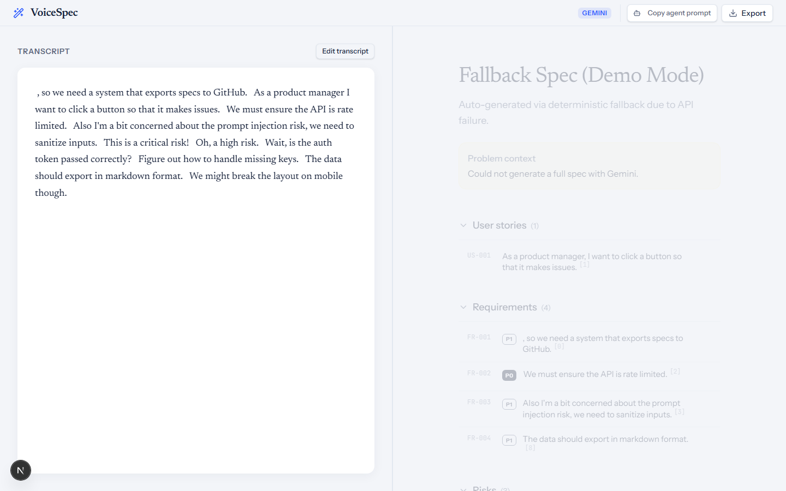
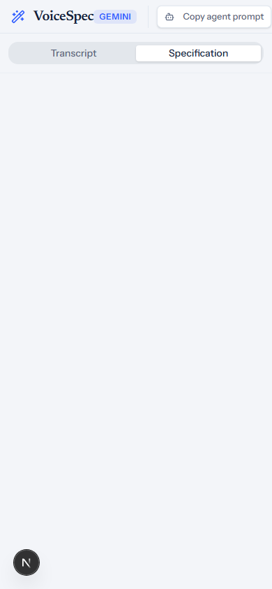
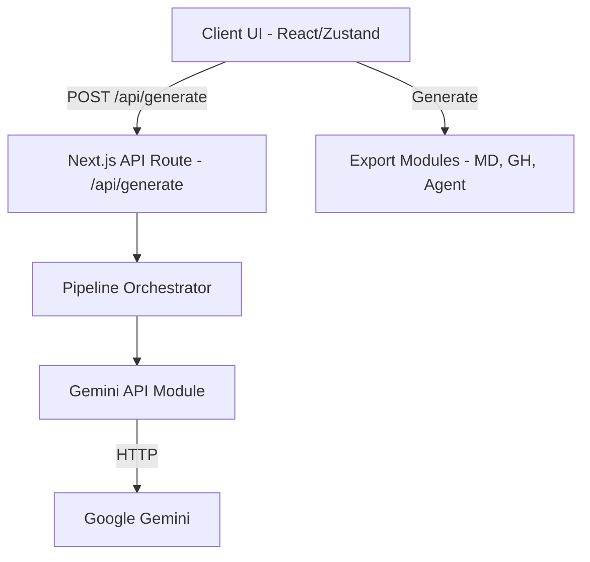
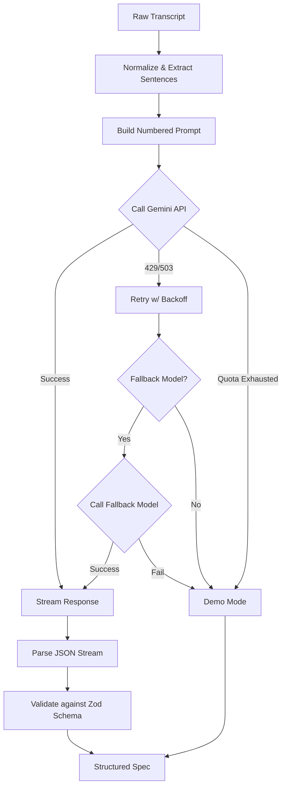

# VoiceSpec

Transform raw product discovery transcripts into structured, developer-ready specifications instantly. Say goodbye to manual spec writing and hello to automated provenance.

**Live Demo:** [Placeholder URL]




## Quickstart with Wispr Flow

Use Wispr Flow to dictate your product thoughts and generate a spec instantly:

1. **Open Wispr Flow** and start a new dictation.
2. **Dictate your thoughts**:
   > "We need to add a dark mode toggle to the settings page. It's really important for users who work at night. P0 priority. It should switch the theme across the entire app. The biggest risk is a flash of unstyled content on load. Add an acceptance criterion that the theme preference must be saved to local storage."
3. **Paste** the dictation into VoiceSpec and hit Generate.

## Features

- **Provenance Highlighting**: Every requirement, user story, task, and risk in the generated specification is linked directly to the original transcript sentence that inspired it. Click a spec item to highlight its source in the transcript.
- **Export to Markdown**: Standard Markdown export of the entire specification.
- **Export Agent Prompt**: Generates a deterministic Markdown prompt, complete with topological sorting for tasks and backtick safety, ready to be pasted into an AI coding agent.
- **Export GitHub Script**: Generates a `gh` CLI shell script to automatically create GitHub Issues for every task, mapping dependencies to issue mentions.
- **Copy Issue Body**: Pick a specific task and copy its detailed issue body to your clipboard.
- **Accessibility**: Includes semantic HTML landmarks, a skip-to-content link, full keyboard navigation, and respects user preferences for reduced-motion.

## Architecture



## Pipeline



## Setup

1. **Clone the repository:**
   ```bash
   git clone https://github.com/mandavavasanth/VoiceSpec.git
   cd VoiceSpec
   ```
2. **Install dependencies:**
   ```bash
   npm install
   ```
3. **Configure environment variables:**
   ```bash
   cp .env.example .env.local
   ```
   Add your `GEMINI_API_KEY` to `.env.local`.
4. **Run the development server:**
   ```bash
   npm run dev
   ```

## Environment Variables

| Variable                | Description                                                                                              |
| ----------------------- | -------------------------------------------------------------------------------------------------------- |
| `GEMINI_API_KEY`        | Your Google Gemini API key. Required for live generation.                                                |
| `GEMINI_MODEL`          | The primary Gemini model to use (default: `gemini-1.5-flash-8b`).                                        |
| `GEMINI_FALLBACK_MODEL` | An optional fallback model to use if the primary model fails due to capacity (e.g., `gemini-1.5-flash`). |
| `FORCE_DEMO_MODE`       | Set to `true` to force demo mode and prevent real network calls to Gemini (used in tests/CI).            |

## Vercel Deployment

1. Push your code to GitHub.
2. Go to Vercel and import the repository.
3. In the environment variables section, add `GEMINI_API_KEY`, `GEMINI_MODEL`, and optionally `GEMINI_FALLBACK_MODEL`.
4. Deploy!

## Design Decisions and Tradeoffs

- **Client-side State**: Zustand is used for client-side state management because it provides a lightweight, predictable store without the boilerplate of Redux, perfectly suiting a single-page spec editor.
- **Serverless API**: Next.js App Router API endpoints provide a secure server environment to handle the Gemini API key without exposing it to the client.
- **Streaming JSON**: The API parses the LLM stream chunk-by-chunk and repairs partial JSON payloads so the user sees results progressively rather than waiting for the entire spec to generate.
- **Resilience**: The pipeline will always output a valid spec. If the Gemini API is down, rate-limited, or if the user exhausts their free quota, the application automatically falls back to a deterministic "Demo Mode".

## Security Notes

- **Content Security Policy**: The application uses an `unsafe-inline` script policy. This is currently required by Next.js in development and for certain hydration mechanisms, though it is a known tradeoff.
- **No Secrets Tracked**: API keys are strictly kept out of version control and are only accessed server-side.

## Limitations

- **Gemini Free Quota**: Because this app relies on the free tier of the Gemini API, heavy usage may result in a `429 Quota Exhausted` error. When this happens, the app will gracefully degrade to Demo Mode output.
- **Capacity Issues**: 503 errors from overloaded Google servers are handled via a fallback model and retries, but if all attempts fail, it will also fall back to Demo Mode.
- **Rate Limiting**: An in-memory token bucket rate limiter is used per-instance (2 requests/min). In a serverless environment like Vercel, this is per-lambda-instance, not global.
- **Length Limit**: Transcripts are capped at 20,000 characters to fit well within the context window and typical processing times.

## Roadmap

- [ ] Dark mode toggle
- [ ] Spec history
- [ ] Transcript diffing

## How it was built

Prompts to the coding agent were dictated with Wispr Flow. API keys, git and hosting logins, and the Vercel setup were entered manually; terminal commands may have been typed. The coding agent models used were Claude Opus 4.6 and Gemini 3.1 Pro.
